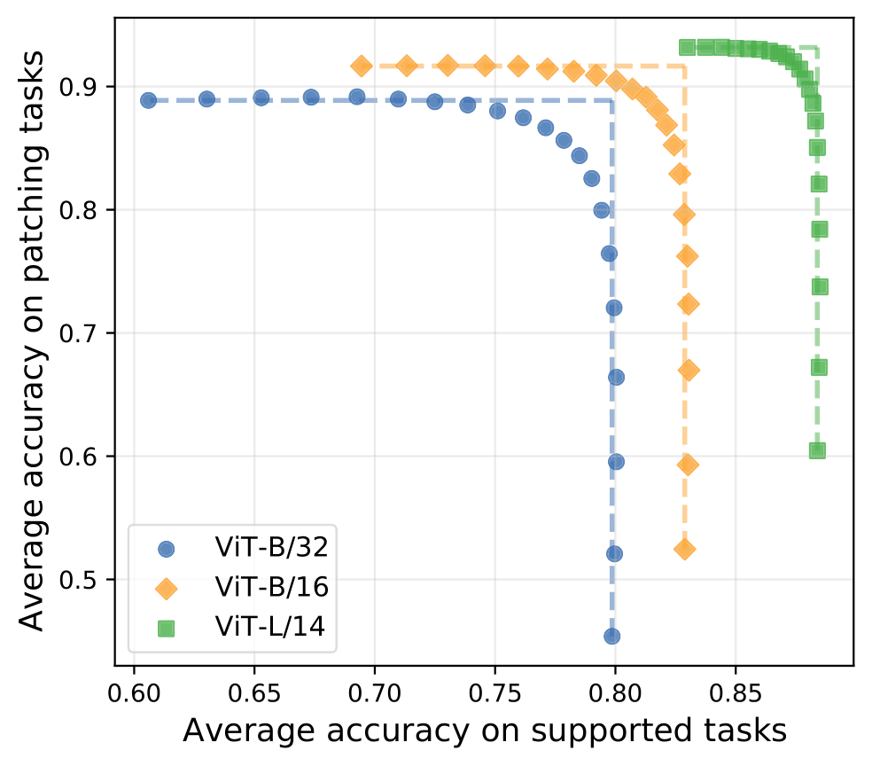

# 🎨 PAINT: Patching open-vocabulary models by interpolating weights

This repository contains code for the paper [Patching open-vocabulary models by interpolating weights](https://arxiv.org/abs/2208.05592), by [Gabriel Ilharco](https://gabrielilharco.com/)\*, [Mitchell Wortsman](https://mitchellnw.github.io/)\*, [Samir Yitzhak Gadre](https://sagadre.github.io/)\*, [Shuran Song](https://www.cs.columbia.edu/~shurans/), [Hannaneh Hajishirzi](https://homes.cs.washington.edu/~hannaneh/), [Simon Kornblith](https://scholar.google.com/citations?user=1O3RPmsAAAAJ&hl=en), [Ali Farhadi](https://homes.cs.washington.edu/~ali/), [Ludwig Schmidt](https://people.csail.mit.edu/ludwigs/).

### Abstract
*Open-vocabulary models like CLIP achieve high accuracy across many image classification tasks. However, there are still settings where their zero-shot performance is far from optimal. We study model patching, where the goal is to improve accuracy on specific tasks without degrading accuracy on tasks where performance is already adequate. Towards this goal, we introduce **PAINT**, a patching method that uses interpolations between the weights of a model before fine-tuning and the weights after fine-tuning on a task to be patched. On nine tasks where zero-shot CLIP performs poorly, PAINT increases accuracy by 15 to 60 percentage points while preserving accuracy on ImageNet within one percentage point of the zero-shot model. PAINT also allows a single model to be patched on multiple tasks and improves with model scale. Furthermore, we identify cases of *broad transfer*, where patching on one task increases accuracy on other tasks even when the tasks have disjoint classes. Finally, we investigate applications beyond common benchmarks such as counting or reducing the impact of typographic attacks on CLIP. Our findings demonstrate that it is possible to expand the set of tasks on which open-vocabulary models achieve high accuracy without re-training them from scratch.*


### Summary figure

<p align="center">

</p>

Given a *patching task*, we wish to improve accuracy without degrading performance on *supported tasks*, where accuracy is already adequate.
When interpolating weights of fine-tuned models (top, left of each curve) and unpatched models (bottom, right of each curve), there are intermediate solutions where accuracy improves on the patching tasks without reducing accuracy on supported tasks.
Results are averaged over nine patching tasks (Stanford Cars, DTD, EuroSAT, GTSRB, KITTI distance, MNIST, RESISC45, SUN397 and SVHN) and five supported tasks (ImageNet, CIFAR-10, CIFAR-100, STL-10 and Food101), and patching is conducted independently on each of the patching tasks.
The dashed lines illustrate vertical movement from the unpatched model and horizontal movement from the fine-tuned model, indicating points without accuracy trade-offs.

## Code

### Overview

Our patching procedure can be implemented in a few lines of code in addition to standard fine-tuning, as shown below. See [src/patch.py](src/patch.py) for more details.

```python
# Load zero-shot model
zeroshot_model = ImageClassifier.load(zeroshot_checkpoint)

# Freeze classification head
zeroshot_model.freeze_head()

# Fine-tune
finetuned_model = finetune(zeroshot_model, patch_dataset)

# interpolate weights with various mixing coefficient alpha
theta_0 = zeroshot_model.state_dict()
theta_1 = finetuned_model.state_dict()
theta = {
    key: (1-alpha) * theta_0[key] + alpha * theta_1[key]
    for key in theta_0.keys()
}

# Update the model acccording to the new weights
finetuned_model.load_state_dict(theta)

# evaluate
evaluate(finetuned_model, eval_tasks)
```

### Install dependencies

```bash
conda env create
conda activate patching
```

### Add directory to PYTHONPATH:

```bash
cd patching
export PYTHONPATH="$PYTHONPATH:$PWD"
```

### Run Patching

Sample command for running patching from scratch using ViT-L/14:

```
python src/patch.py   \
    --train-dataset=MNIST  \
    --epochs=5  \
    --lr=0.00001  \
    --batch-size=128  \
    --model=ViT-L/14  \
    --eval-datasets=ImageNet,MNIST  \
    --results-db=results.jsonl  \
    --save=models/patch/ViTL14  \
    --data-location=~/data \
    --alpha 0 0.1 0.2 0.3 0.4 0.5 0.6 0.7 0.8 0.9 1.0
```


## Typographic attack data

The data can be found at `typographic_attack_data.zip`. The annotations for each image are in the name of the file.
For instance, `label=dog_text=cat.png` is an image of a "dog", with "cat" written on it. 
